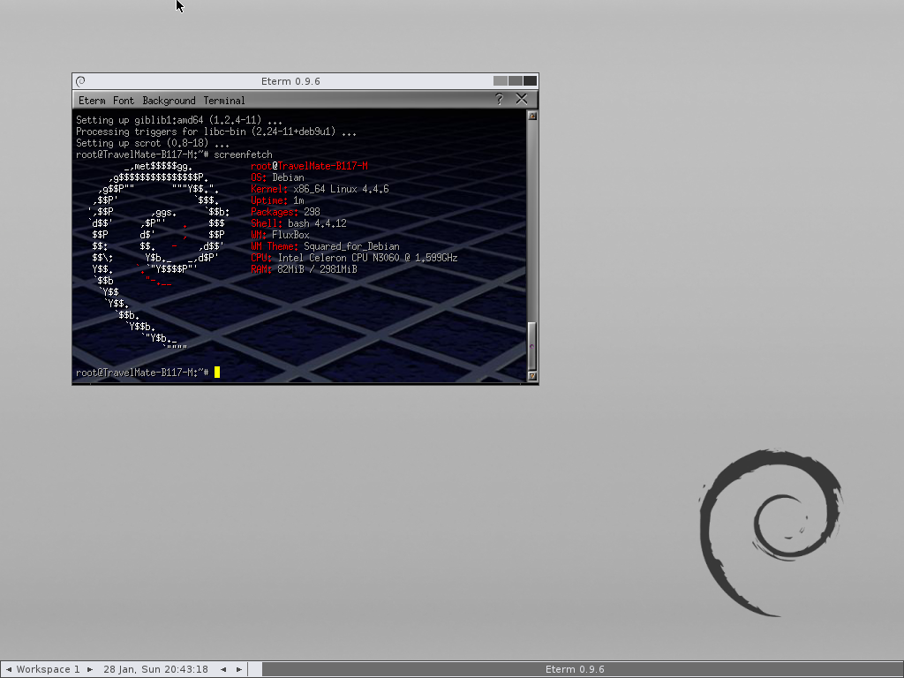

# debootstrap_live
Generates a bootable ISO with current kernel and debootstrap base system
https://www.gitbook.com/book/siad/create-your-own-debian-based-linux-distro/details

<h4>Preparation</h4>

sudo apt install wget make gawk gcc bc libelf-dev xorriso debootstrap curl

<h4>Download</h4>

git clone https://github.com/zac87/debootstrap_live.git

<h4>Usage</h4>

cd debootstrap_live &&
chmod +x *.sh &&
sudo ./debootstrap_live

The script will take a while to complete the build process.
NOTE that debootstrap will not work on a encrypted partition. 
Try to make the changes suggested in 03_fetch_root_fs.sh 

This script is based on the work of Ivan Davidov http://minimal.linux-bg.org
